## 경력

[교원크리에이티브](http://www.kyowoncreative.com/)
- 연구원 - 2019/04 ~ 재직중

[Brainboot](http://brainboot.kr/)
- 팀장 - 2018/04 ~ 2019/02

[중고나라](http://qdillion.com/)
- 선임 - 2016/05 ~ 2018/03

[야놀자](http://yanolja.in/ko/)
- 사원 - 2014/10 ~ 2016/05

[유아이투/Ui2](https://www.ui2.co.kr/)
- 사원 - 2013/03 ~ 2014/05

[엔라이즈/Nrise](https://nrise.net)
- 2011/12 ~ 2012/08

## 회사 프로젝트

### 거래소
코인 거래소 앱
- 소속 : Brainboot
- 역할 : Android App 개발
- 사용기술 : Android, Java, Kotlin, RxJava
- PlayStore
  코러버 - (https://play.google.com/store/apps/details?id=com.colover.coin&hl=ko)

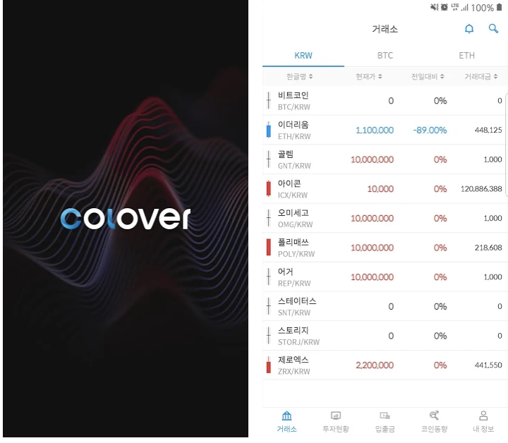

  뉴비트 - (https://play.google.com/store/apps/details?id=com.newbitkorea.coin) 외 3개

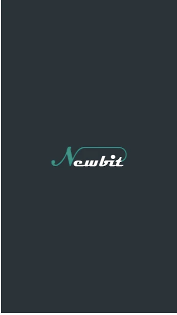 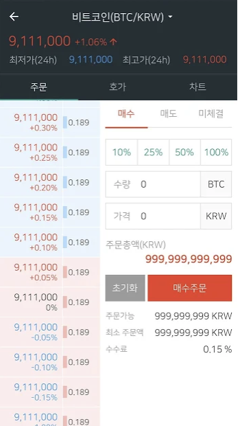

### 중고나라
중고나라 서비스
- 기간 : 2016/06 ~ 2018/03
- 소속 : 큐딜리온
- 역할 : Android 앱 개발, 유지보수
- 사용기술 : Android, Java, Kotlin
- PlayStore (https://play.google.com/store/apps/details?id=com.elz.secondhandstore)

  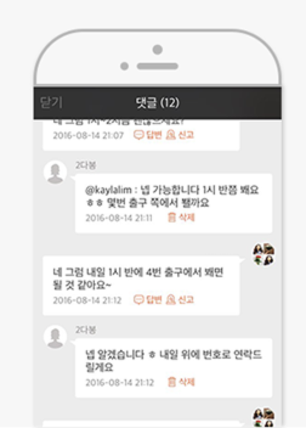 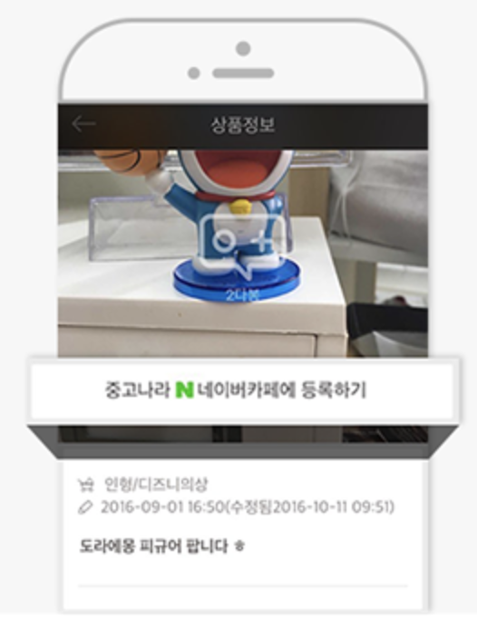

### 주마
중고 물품을 수거 신청 및 확인 서비스
- 기간 : 2016/06 ~ 2017/01
- 소속 : 큐딜리온
- 역할 : Android 앱 개발, 유지보수
- 사용기술 : Android, Java
- PlayStore (https://play.google.com/store/apps/details?id=com.qdillion.zooma)

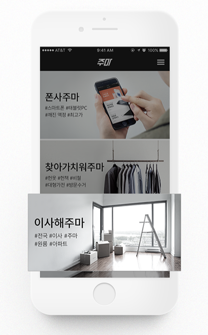

### 야놀자
호텔, 펜션, 모텔, 게하, 레저/티켓, 액티비티 소개 및 예약
- 기간 : 2015/05 ~ 2016/05
- 소속 : 야놀자
- 역할 : Android 앱 개발(일부 기능 개발), 유지보수, 비콘, Bluetooth
- 사용기술 : Android, Java
- PlayStore (https://play.google.com/store/apps/details?id=com.cultsotry.yanolja.nativeapp)

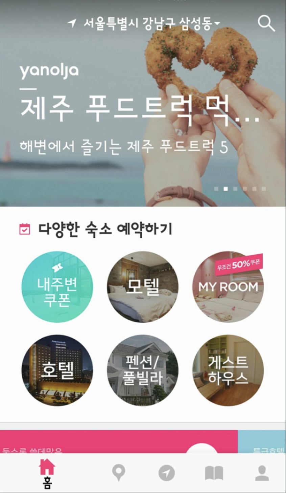  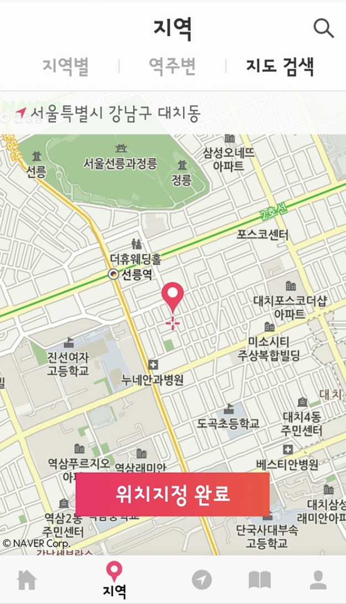  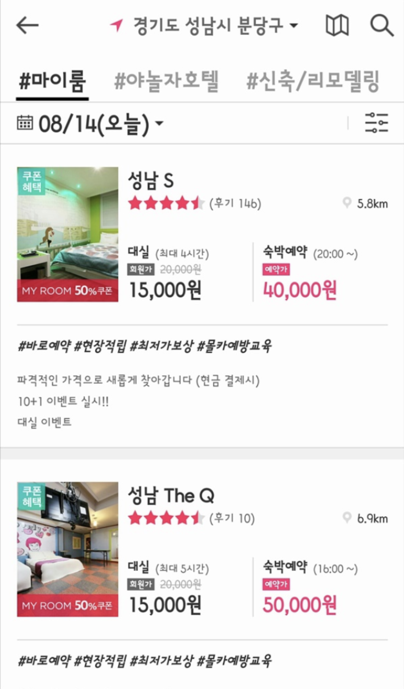

### 야놀자바로예약
호텔, 모텔, 펜션, 게하 예약 서비스
- 기간 : 2015/08 ~ 2016/05
- 소속 : 야놀자
- 역할 : Android 앱 신규 개발
- 사용기술 : Android, Java
- 서비스종료

    

### 모가
호텔, 모텔 관련 서비스
- 기간 : 2014/10 ~ 2015/12
- 소속 : 야놀자비즈
- 역할 : Android 앱 신규 개발, 유지보수
- 사용기술 : Android, Java
- 서비스종료

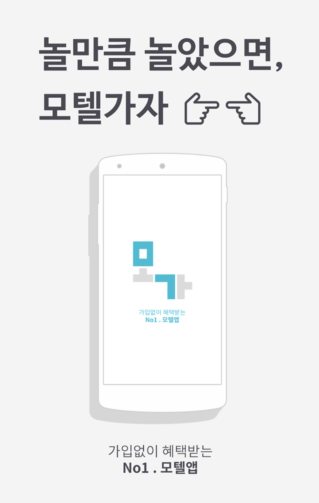  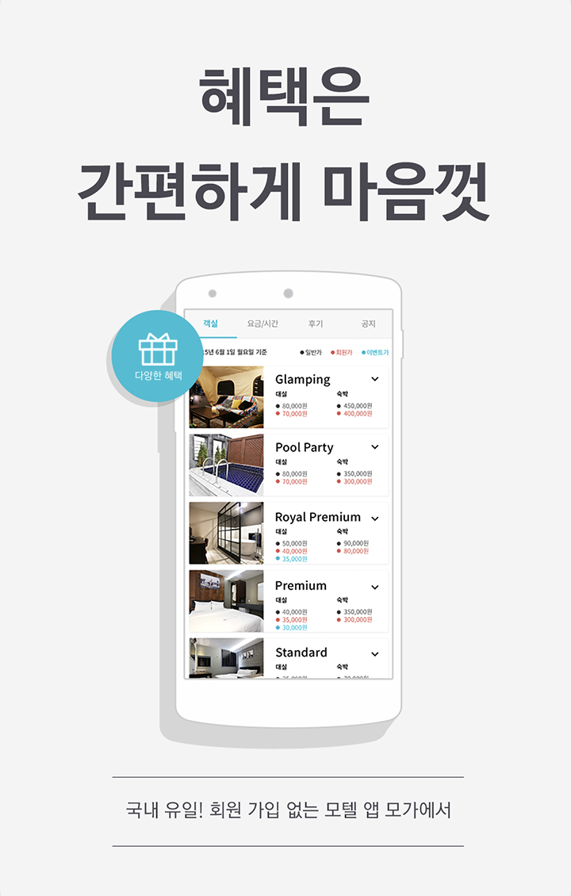  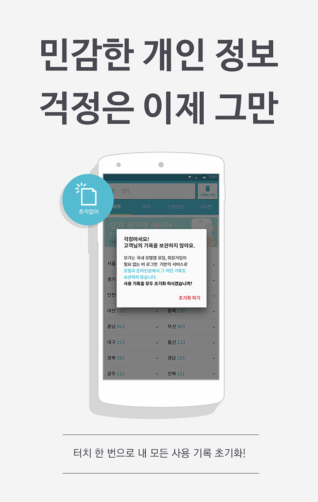  

### 호텔업
호텔 모텔 관련 구직, 취업 등 여러가지 정보 제공
- 기간 : 2014/12 ~ 2016/03
- 소속 : 야놀자비즈
- 역할 : Android 앱 개발
- 사용기술 : Android, Java(Hybrid)
- PlayStore (https://play.google.com/store/apps/details?id=com.yanolja.motelup)

    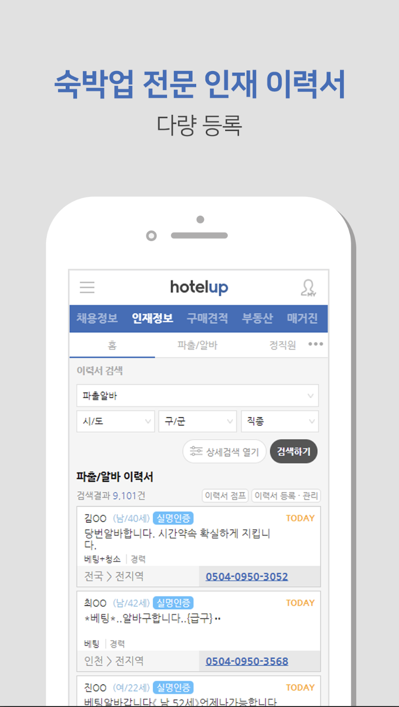

### DMMS2
맥심 커피 토트 추적하는 앱
- 기간 : 2014/12 ~ 2016/03
- 소속 : Ui2
- 역할 : Android 앱 개발
- 사용기술 : Android, Java
- PlayStore (https://play.google.com/store/apps/details?id=kr.co.ui2.openedge)

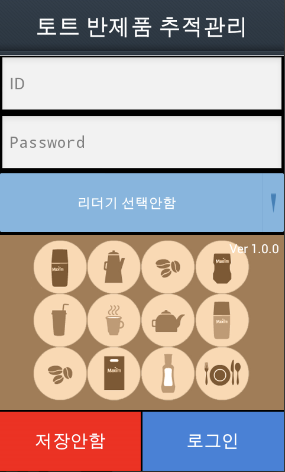

## 개인 프로젝트

### Tripperget (가명)
여행 가계부
- 기간: 2019/01/01 ~ 작업중.
- PlayStore(등록 예정)
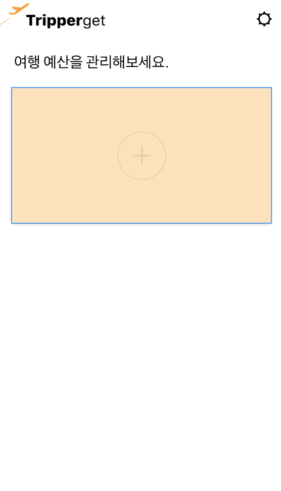

### 영동대
영동대(현 유원대) 버스 시간 제공
- 기간: 2015/11/20 ~
- 사용기술 : Android, Java
- PlayStore (https://play.google.com/store/apps/details?id=chic.hy.ydub&hl=ko)

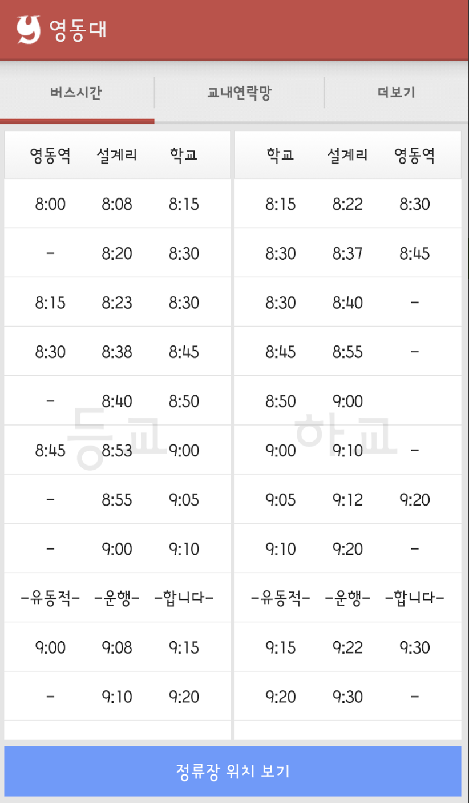 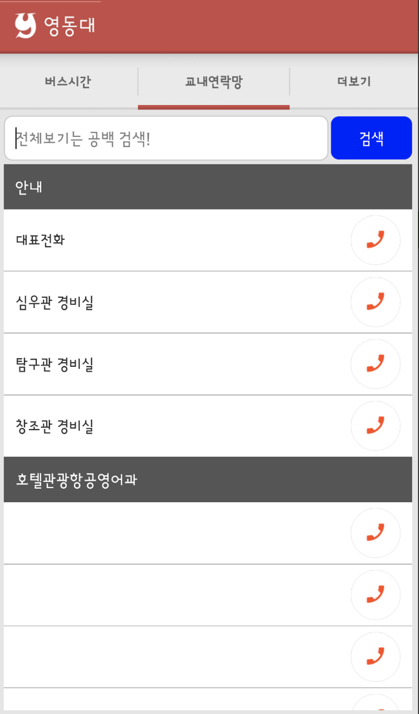 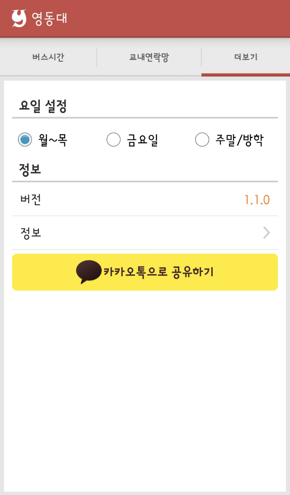

